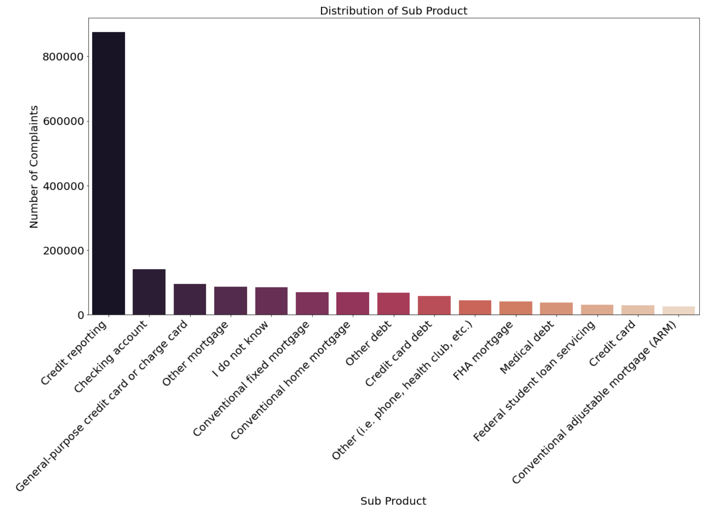
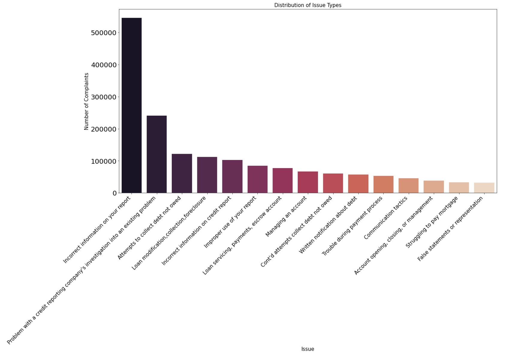
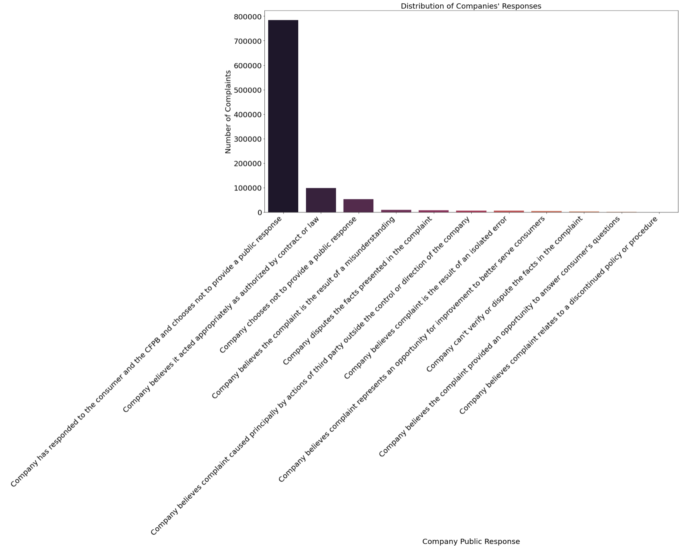
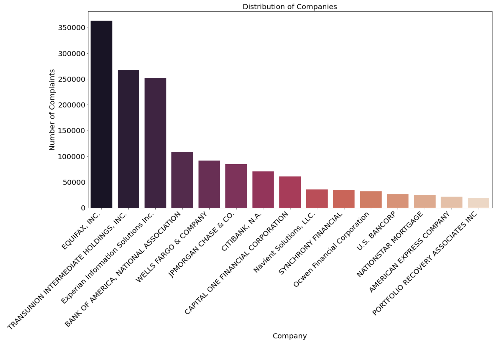
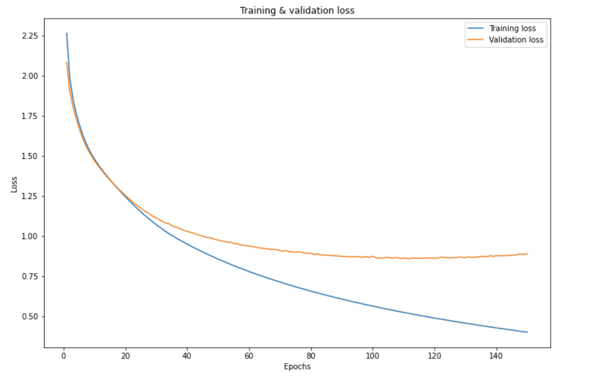
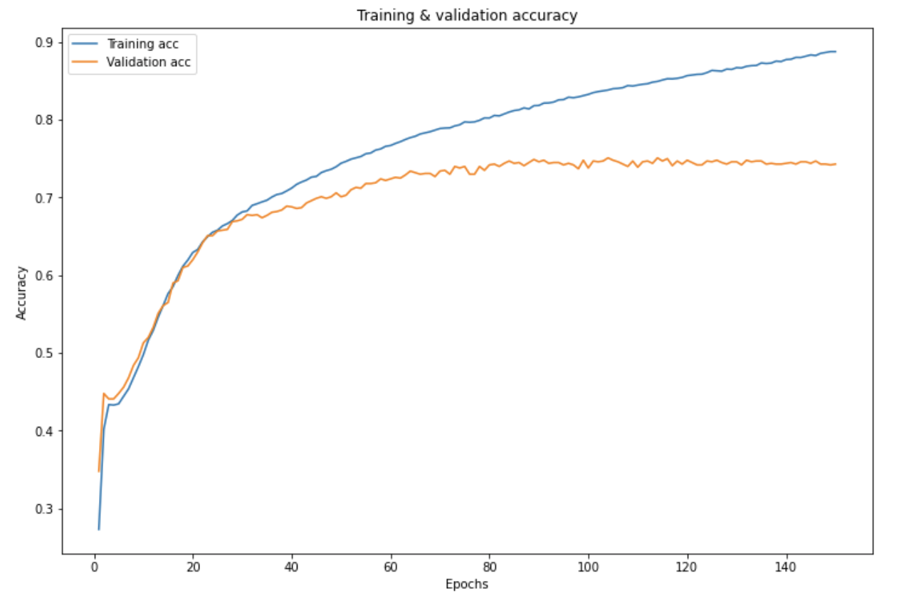
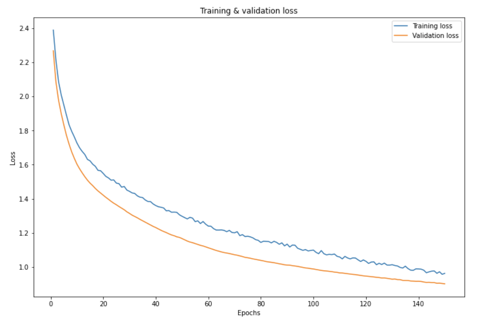
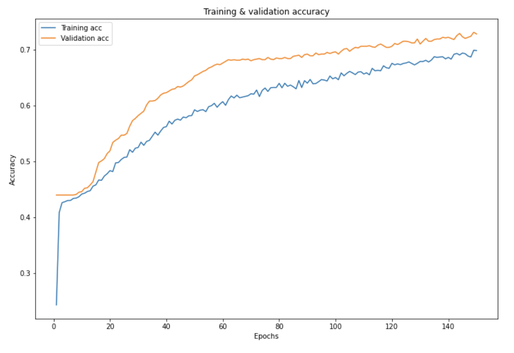

# Classification of Bank Customer Complaints
**Author:** Aziza Gulyamova
***

## Business Problem
It is clear that most of the businessess are client oriented and their success depends on customers' experiences. Customer complaints categorization can be useful to automatically categorize the reason of client's unsatisfaction and help to quickly respond to them when they (and your company) need it most. This project aims to classify the complains of bank customers.

***
## Data
The data for this project was obtained from Consumer Financial Protection Bureau. It is a collection of complaints about consumer financial products and services that were sent to companies for response. The data consists of more than 2 million observations and 17 features.

## Data Cleaning

For the purpose of the project I have removed all unrelated features and dropped missing values. By the end of data cleaning, the table contained the `Product` column as the target variable and `Customers complaint narrative` as a feature. There were approximately one million observations left.

# Exploratory Analysis of Data

Before proceeding to modeling I've performed EDA and plotted graphs.

### Distribution of Sub-Products

### Issue Types

### Companies Responces

### Companies Distibution

## EDA Results:

* Most of the complaints are **related to credit reporting**
* The most common issue is that **company has incorrect information**
* Vast amount of the complaints were **responded by companies to customer and CFBP**
* Majority of the complaints are directed to **Equifax and Transunion**

# Modeling

As a baseline model I chose the `Sequential()` model with two hidden layers and `ReLU` activation functions. The output layer had `Softmax` function. The total number of epochs was 150. 

As the graph shows, the model had high **Accuracy** Score for training data and started to overfitt it with the increase in epoch numbers. 

### Final Model
My final model was `Sequential()` with `Dropout` regularization and same amount layers and function.

The graph shows improvement in term of overfitting, although the accuracy score went down. 

## Modeling Conclusions

1. With dropout regularization I was able to achieve more sufficient results for model. The accuracy of the model is 0.79 for the final model on training set.

2. The data is imbalanced, since most of the complaints fall into `Credit Reporting` category. 

# Conclusions

1. Most of the complaints are about credit reporting and it would be suggested to closely investigate the credit deparment of the banks.

2. Since the complaints are mostly related to incorrect information, it would be benefitial to improve the ability of proper data handling

3. The companies such as Equifax and Transunion should closesly investigate their credit report department.

# Next Steps

1. Deal with data imbalance

2. Bin the `Product` feature to less categories.

